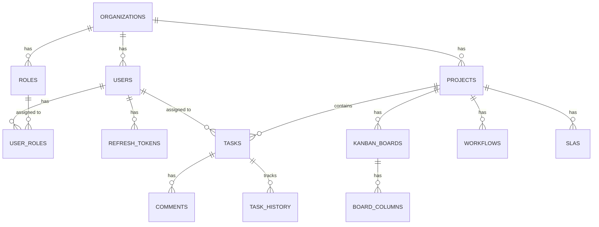
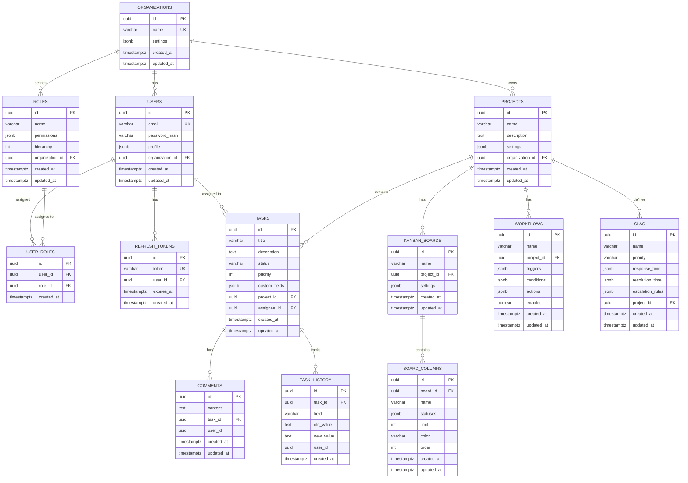
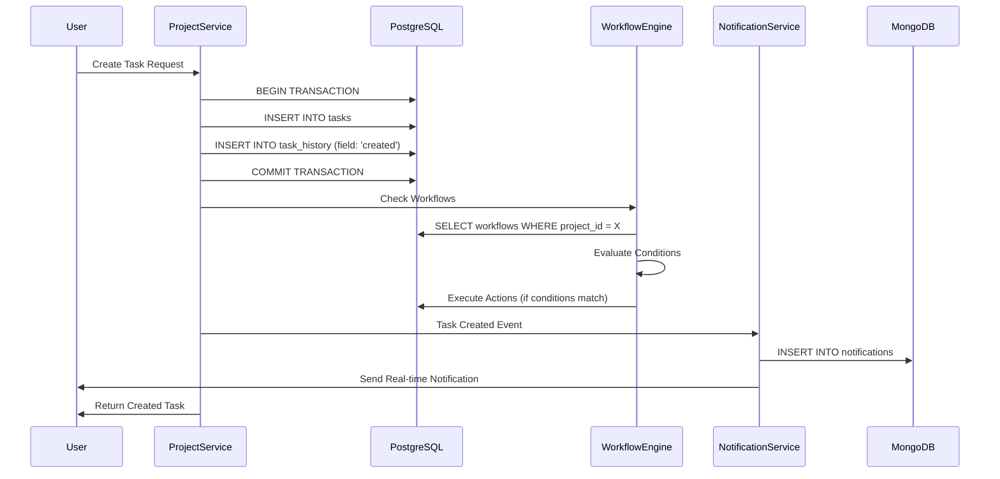

# 🗄️ Database Architecture

## Table of Contents
1. [Overview](#overview)
2. [Database Strategy](#database-strategy)
3. [Entity Relationship Diagram (ERD)](#entity-relationship-diagram-erd)
4. [Table Structures](#table-structures)
5. [Relationships & Constraints](#relationships--constraints)
6. [Indexes & Performance](#indexes--performance)
7. [JSONB Field Structures](#jsonb-field-structures)
8. [Data Flow](#data-flow)
9. [Multi-Database Strategy](#multi-database-strategy)

---

## Overview

The Task Management System uses a **multi-database architecture** with:
- **PostgreSQL** - Primary transactional database for core entities
- **MongoDB** - Secondary database for audit logs, activity feeds, and notifications
- **Redis** (Future) - Caching and session management

This document focuses on the **PostgreSQL schema** which contains all core business entities.

---

## Database Strategy

### Primary Database: PostgreSQL 15+

**Purpose**: Transactional data, relationships, ACID compliance

**Contains**:
- Organizations, Users, Roles (RBAC)
- Projects, Tasks, Comments
- Workflows, Kanban Boards, SLAs
- Task History

**Features Used**:
- UUID primary keys
- JSONB for flexible schema (custom fields, settings)
- GIN indexes for JSONB queries
- Foreign key constraints with CASCADE
- Timestamps with timezone (TIMESTAMPTZ)

### Secondary Database: MongoDB

**Purpose**: High-volume, flexible schema data

**Contains**:
- Audit logs
- Activity feeds
- Notification history
- File metadata

**Why MongoDB**:
- Better for high-volume writes
- Flexible schema for varying log structures
- Better horizontal scaling for logs

---

## Entity Relationship Diagram (ERD)

### High-Level ERD



### Detailed ERD with Attributes



---

## Table Structures

### 1. Organizations Table

**Purpose**: Multi-tenant organization management

```sql
CREATE TABLE organizations (
    id UUID PRIMARY KEY DEFAULT gen_random_uuid(),
    name VARCHAR(255) NOT NULL UNIQUE,
    settings JSONB DEFAULT '{}',
    created_at TIMESTAMPTZ DEFAULT NOW(),
    updated_at TIMESTAMPTZ DEFAULT NOW()
);
```

**Columns**:
- `id` - Primary key (UUID)
- `name` - Organization name (unique)
- `settings` - JSONB for flexible organization settings
- `created_at` - Creation timestamp
- `updated_at` - Last update timestamp

**Indexes**:
- Primary key on `id`
- Unique index on `name`

---

### 2. Users Table

**Purpose**: User accounts and authentication

```sql
CREATE TABLE users (
    id UUID PRIMARY KEY DEFAULT gen_random_uuid(),
    email VARCHAR(255) UNIQUE NOT NULL,
    password_hash VARCHAR(255) NOT NULL,
    profile JSONB DEFAULT '{}',
    organization_id UUID NOT NULL REFERENCES organizations(id) ON DELETE CASCADE,
    created_at TIMESTAMPTZ DEFAULT NOW(),
    updated_at TIMESTAMPTZ DEFAULT NOW()
);
```

**Columns**:
- `id` - Primary key (UUID)
- `email` - User email (unique, used for login)
- `password_hash` - Bcrypt/Argon2 hashed password
- `profile` - JSONB for user profile data (name, avatar, preferences, etc.)
- `organization_id` - Foreign key to organizations
- `created_at` - Creation timestamp
- `updated_at` - Last update timestamp

**Indexes**:
- Primary key on `id`
- Unique index on `email`
- Index on `organization_id` (for filtering users by org)

**Constraints**:
- `organization_id` must reference existing organization
- Cascade delete: if organization is deleted, all users are deleted

---

### 3. Roles Table

**Purpose**: Role-Based Access Control (RBAC)

```sql
CREATE TABLE roles (
    id UUID PRIMARY KEY DEFAULT gen_random_uuid(),
    name VARCHAR(100) NOT NULL,
    permissions JSONB NOT NULL,
    hierarchy INTEGER DEFAULT 0,
    organization_id UUID NOT NULL REFERENCES organizations(id) ON DELETE CASCADE,
    created_at TIMESTAMPTZ DEFAULT NOW(),
    updated_at TIMESTAMPTZ DEFAULT NOW()
);
```

**Columns**:
- `id` - Primary key (UUID)
- `name` - Role name (e.g., "Admin", "Developer", "Viewer")
- `permissions` - JSONB array of permission objects
- `hierarchy` - Numeric hierarchy level (higher = more permissions)
- `organization_id` - Foreign key to organizations
- `created_at` - Creation timestamp
- `updated_at` - Last update timestamp

**Indexes**:
- Primary key on `id`
- Index on `organization_id`

**Constraints**:
- Roles are organization-specific
- Cascade delete with organization

---

### 4. User Roles Table (Junction)

**Purpose**: Many-to-many relationship between users and roles

```sql
CREATE TABLE user_roles (
    id UUID PRIMARY KEY DEFAULT gen_random_uuid(),
    user_id UUID NOT NULL REFERENCES users(id) ON DELETE CASCADE,
    role_id UUID NOT NULL REFERENCES roles(id) ON DELETE CASCADE,
    created_at TIMESTAMPTZ DEFAULT NOW(),
    UNIQUE(user_id, role_id)
);
```

**Columns**:
- `id` - Primary key (UUID)
- `user_id` - Foreign key to users
- `role_id` - Foreign key to roles
- `created_at` - Assignment timestamp

**Indexes**:
- Primary key on `id`
- Unique constraint on `(user_id, role_id)` - prevents duplicate assignments

**Constraints**:
- A user can have multiple roles
- A role can be assigned to multiple users
- Cascade delete: if user or role is deleted, assignments are deleted

---

### 5. Refresh Tokens Table

**Purpose**: JWT refresh token storage

```sql
CREATE TABLE refresh_tokens (
    id UUID PRIMARY KEY DEFAULT gen_random_uuid(),
    token VARCHAR(500) UNIQUE NOT NULL,
    user_id UUID NOT NULL REFERENCES users(id) ON DELETE CASCADE,
    expires_at TIMESTAMPTZ NOT NULL,
    created_at TIMESTAMPTZ DEFAULT NOW()
);
```

**Columns**:
- `id` - Primary key (UUID)
- `token` - Refresh token string (unique)
- `user_id` - Foreign key to users
- `expires_at` - Token expiration timestamp
- `created_at` - Token creation timestamp

**Indexes**:
- Primary key on `id`
- Unique index on `token`
- Index on `user_id` (for finding user's tokens)
- Index on `expires_at` (for cleanup queries)

**Constraints**:
- Cascade delete: if user is deleted, tokens are deleted

---

### 6. Projects Table

**Purpose**: Project/workspace management

```sql
CREATE TABLE projects (
    id UUID PRIMARY KEY DEFAULT gen_random_uuid(),
    name VARCHAR(255) NOT NULL,
    description TEXT,
    settings JSONB DEFAULT '{}',
    organization_id UUID NOT NULL REFERENCES organizations(id) ON DELETE CASCADE,
    created_at TIMESTAMPTZ DEFAULT NOW(),
    updated_at TIMESTAMPTZ DEFAULT NOW()
);
```

**Columns**:
- `id` - Primary key (UUID)
- `name` - Project name
- `description` - Project description (optional)
- `settings` - JSONB for project-specific settings
- `organization_id` - Foreign key to organizations
- `created_at` - Creation timestamp
- `updated_at` - Last update timestamp

**Indexes**:
- Primary key on `id`
- Index on `organization_id` (for filtering projects by org)

**Constraints**:
- Cascade delete: if organization is deleted, projects are deleted

---

### 7. Tasks Table

**Purpose**: Core task/ticket management

```sql
CREATE TABLE tasks (
    id UUID PRIMARY KEY DEFAULT gen_random_uuid(),
    title VARCHAR(500) NOT NULL,
    description TEXT,
    status VARCHAR(50) DEFAULT 'todo',
    priority INTEGER DEFAULT 0,
    custom_fields JSONB DEFAULT '{}',
    project_id UUID NOT NULL REFERENCES projects(id) ON DELETE CASCADE,
    assignee_id UUID REFERENCES users(id) ON DELETE SET NULL,
    created_at TIMESTAMPTZ DEFAULT NOW(),
    updated_at TIMESTAMPTZ DEFAULT NOW()
);
```

**Columns**:
- `id` - Primary key (UUID)
- `title` - Task title
- `description` - Task description (optional)
- `status` - Task status (e.g., "todo", "in_progress", "done", "blocked")
- `priority` - Priority level (0 = lowest, higher = more priority)
- `custom_fields` - JSONB for custom task fields (flexible schema)
- `project_id` - Foreign key to projects
- `assignee_id` - Foreign key to users (optional, nullable)
- `created_at` - Creation timestamp
- `updated_at` - Last update timestamp

**Indexes**:
- Primary key on `id`
- Composite index on `(project_id, status)` - for filtering tasks by project and status
- Index on `assignee_id` - for finding user's assigned tasks
- GIN index on `custom_fields` - for JSONB queries

**Constraints**:
- Cascade delete: if project is deleted, tasks are deleted
- Set null: if assignee is deleted, task remains but assignee_id becomes NULL

**Common Status Values**:
- `todo` - Not started
- `in_progress` - Currently being worked on
- `review` - Under review
- `done` - Completed
- `blocked` - Blocked by dependency
- `cancelled` - Cancelled

---

### 8. Comments Table

**Purpose**: Task comments and discussions

```sql
CREATE TABLE comments (
    id UUID PRIMARY KEY DEFAULT gen_random_uuid(),
    content TEXT NOT NULL,
    task_id UUID NOT NULL REFERENCES tasks(id) ON DELETE CASCADE,
    user_id UUID NOT NULL,
    created_at TIMESTAMPTZ DEFAULT NOW(),
    updated_at TIMESTAMPTZ DEFAULT NOW()
);
```

**Columns**:
- `id` - Primary key (UUID)
- `content` - Comment text content
- `task_id` - Foreign key to tasks
- `user_id` - User ID (UUID, not FK to allow cross-service references)
- `created_at` - Creation timestamp
- `updated_at` - Last update timestamp

**Indexes**:
- Primary key on `id`
- Index on `task_id` - for loading all comments for a task

**Constraints**:
- Cascade delete: if task is deleted, comments are deleted
- Note: `user_id` is not a foreign key to allow flexibility across services

---

### 9. Task History Table

**Purpose**: Audit trail for task changes

```sql
CREATE TABLE task_history (
    id UUID PRIMARY KEY DEFAULT gen_random_uuid(),
    task_id UUID NOT NULL REFERENCES tasks(id) ON DELETE CASCADE,
    field VARCHAR(100) NOT NULL,
    old_value TEXT,
    new_value TEXT,
    user_id UUID NOT NULL,
    created_at TIMESTAMPTZ DEFAULT NOW()
);
```

**Columns**:
- `id` - Primary key (UUID)
- `task_id` - Foreign key to tasks
- `field` - Name of the field that changed (e.g., "status", "priority", "assignee_id")
- `old_value` - Previous value (as text)
- `new_value` - New value (as text)
- `user_id` - User who made the change
- `created_at` - Change timestamp

**Indexes**:
- Primary key on `id`
- Index on `task_id` - for loading task history
- Index on `created_at` - for time-based queries

**Constraints**:
- Cascade delete: if task is deleted, history is deleted

**Use Cases**:
- Audit trail
- Activity feed
- Change notifications
- Reporting on task lifecycle

---

### 10. Kanban Boards Table

**Purpose**: Kanban board configuration

```sql
CREATE TABLE kanban_boards (
    id UUID PRIMARY KEY DEFAULT gen_random_uuid(),
    name VARCHAR(255) NOT NULL,
    project_id UUID NOT NULL REFERENCES projects(id) ON DELETE CASCADE,
    settings JSONB DEFAULT '{}',
    created_at TIMESTAMPTZ DEFAULT NOW(),
    updated_at TIMESTAMPTZ DEFAULT NOW()
);
```

**Columns**:
- `id` - Primary key (UUID)
- `name` - Board name
- `project_id` - Foreign key to projects
- `settings` - JSONB for board settings (filters, views, etc.)
- `created_at` - Creation timestamp
- `updated_at` - Last update timestamp

**Indexes**:
- Primary key on `id`
- Index on `project_id` - for loading boards by project

**Constraints**:
- Cascade delete: if project is deleted, boards are deleted

---

### 11. Board Columns Table

**Purpose**: Kanban board column configuration

```sql
CREATE TABLE board_columns (
    id UUID PRIMARY KEY DEFAULT gen_random_uuid(),
    board_id UUID NOT NULL REFERENCES kanban_boards(id) ON DELETE CASCADE,
    name VARCHAR(100) NOT NULL,
    statuses JSONB NOT NULL,
    limit INTEGER,
    color VARCHAR(7) NOT NULL,
    order INTEGER DEFAULT 0,
    created_at TIMESTAMPTZ DEFAULT NOW(),
    updated_at TIMESTAMPTZ DEFAULT NOW()
);
```

**Columns**:
- `id` - Primary key (UUID)
- `board_id` - Foreign key to kanban_boards
- `name` - Column name (e.g., "To Do", "In Progress", "Done")
- `statuses` - JSONB array of status strings that belong to this column
- `limit` - WIP (Work In Progress) limit (optional)
- `color` - Hex color code for column (e.g., "#3B82F6")
- `order` - Display order (for sorting columns)
- `created_at` - Creation timestamp
- `updated_at` - Last update timestamp

**Indexes**:
- Primary key on `id`
- Index on `board_id` - for loading columns by board
- Index on `order` - for sorting columns

**Constraints**:
- Cascade delete: if board is deleted, columns are deleted

**Example `statuses` JSONB**:
```json
["todo", "backlog"]
```

---

### 12. Workflows Table

**Purpose**: Automation workflow definitions

```sql
CREATE TABLE workflows (
    id UUID PRIMARY KEY DEFAULT gen_random_uuid(),
    name VARCHAR(255) NOT NULL,
    project_id UUID NOT NULL REFERENCES projects(id) ON DELETE CASCADE,
    triggers JSONB NOT NULL,
    conditions JSONB NOT NULL,
    actions JSONB NOT NULL,
    enabled BOOLEAN DEFAULT true,
    created_at TIMESTAMPTZ DEFAULT NOW(),
    updated_at TIMESTAMPTZ DEFAULT NOW()
);
```

**Columns**:
- `id` - Primary key (UUID)
- `name` - Workflow name
- `project_id` - Foreign key to projects
- `triggers` - JSONB array of trigger definitions
- `conditions` - JSONB array of condition definitions
- `actions` - JSONB array of action definitions
- `enabled` - Whether workflow is active
- `created_at` - Creation timestamp
- `updated_at` - Last update timestamp

**Indexes**:
- Primary key on `id`
- Index on `project_id` - for loading workflows by project
- Index on `enabled` - for filtering active workflows

**Constraints**:
- Cascade delete: if project is deleted, workflows are deleted

**Example Workflow Structure**:
```json
{
  "triggers": [
    {
      "type": "task_created",
      "config": {}
    }
  ],
  "conditions": [
    {
      "type": "priority_equals",
      "field": "priority",
      "value": 5
    }
  ],
  "actions": [
    {
      "type": "assign_user",
      "config": {
        "userId": "user-uuid"
      }
    },
    {
      "type": "send_notification",
      "config": {
        "channel": "email",
        "template": "high_priority_task"
      }
    }
  ]
}
```

---

### 13. SLAs Table

**Purpose**: Service Level Agreement definitions

```sql
CREATE TABLE slas (
    id UUID PRIMARY KEY DEFAULT gen_random_uuid(),
    name VARCHAR(255) NOT NULL,
    priority VARCHAR(20) NOT NULL,
    response_time JSONB NOT NULL,
    resolution_time JSONB NOT NULL,
    escalation_rules JSONB NOT NULL,
    project_id UUID NOT NULL REFERENCES projects(id) ON DELETE CASCADE,
    created_at TIMESTAMPTZ DEFAULT NOW(),
    updated_at TIMESTAMPTZ DEFAULT NOW()
);
```

**Columns**:
- `id` - Primary key (UUID)
- `name` - SLA name (e.g., "Standard Support", "Premium Support")
- `priority` - Priority level this SLA applies to ("low", "medium", "high", "critical")
- `response_time` - JSONB duration object for first response time
- `resolution_time` - JSONB duration object for resolution time
- `escalation_rules` - JSONB array of escalation rule definitions
- `project_id` - Foreign key to projects
- `created_at` - Creation timestamp
- `updated_at` - Last update timestamp

**Indexes**:
- Primary key on `id`
- Index on `project_id` - for loading SLAs by project
- Index on `priority` - for matching SLA to task priority

**Constraints**:
- Cascade delete: if project is deleted, SLAs are deleted

**Example SLA Structure**:
```json
{
  "response_time": {
    "value": 2,
    "unit": "hours",
    "business_hours_only": true
  },
  "resolution_time": {
    "value": 24,
    "unit": "hours",
    "business_hours_only": false
  },
  "escalation_rules": [
    {
      "threshold": "50%",
      "action": "notify_manager",
      "config": {
        "role": "manager"
      }
    },
    {
      "threshold": "80%",
      "action": "notify_director",
      "config": {
        "role": "director"
      }
    }
  ]
}
```

---

## Relationships & Constraints

### Relationship Summary

| Parent Table | Child Table | Relationship | On Delete |
|-------------|-------------|--------------|-----------|
| organizations | users | One-to-Many | CASCADE |
| organizations | roles | One-to-Many | CASCADE |
| organizations | projects | One-to-Many | CASCADE |
| users | user_roles | One-to-Many | CASCADE |
| roles | user_roles | One-to-Many | CASCADE |
| users | refresh_tokens | One-to-Many | CASCADE |
| users | tasks | One-to-Many | SET NULL |
| projects | tasks | One-to-Many | CASCADE |
| projects | kanban_boards | One-to-Many | CASCADE |
| projects | workflows | One-to-Many | CASCADE |
| projects | slas | One-to-Many | CASCADE |
| tasks | comments | One-to-Many | CASCADE |
| tasks | task_history | One-to-Many | CASCADE |
| kanban_boards | board_columns | One-to-Many | CASCADE |

### Cascade Delete Strategy

**CASCADE Delete** (Child deleted when parent deleted):
- Users when Organization deleted
- Roles when Organization deleted
- Projects when Organization deleted
- Tasks when Project deleted
- Comments when Task deleted
- Task History when Task deleted
- All child entities follow parent deletion

**SET NULL** (Foreign key set to NULL when parent deleted):
- Task `assignee_id` when User deleted (task remains, just unassigned)

**Rationale**:
- CASCADE ensures data integrity - no orphaned records
- SET NULL for assignee preserves task data even if user is deleted

---

## Indexes & Performance

### Index Strategy

```sql
-- User-related indexes
CREATE INDEX idx_users_organization ON users(organization_id);
CREATE INDEX idx_users_email ON users(email);  -- Already unique, but explicit

-- Role-related indexes
CREATE INDEX idx_roles_organization ON roles(organization_id);

-- Task-related indexes
CREATE INDEX idx_tasks_project_status ON tasks(project_id, status);
CREATE INDEX idx_tasks_assignee ON tasks(assignee_id);
CREATE INDEX idx_tasks_custom_fields ON tasks USING GIN(custom_fields);

-- Comment indexes
CREATE INDEX idx_comments_task ON comments(task_id);

-- Task history indexes
CREATE INDEX idx_task_history_task ON task_history(task_id);
CREATE INDEX idx_task_history_created ON task_history(created_at);

-- Board indexes
CREATE INDEX idx_board_columns_board ON board_columns(board_id);
CREATE INDEX idx_board_columns_order ON board_columns(order);

-- Project indexes
CREATE INDEX idx_projects_organization ON projects(organization_id);

-- Refresh token indexes
CREATE INDEX idx_refresh_tokens_user ON refresh_tokens(user_id);
CREATE INDEX idx_refresh_tokens_expires ON refresh_tokens(expires_at);
```

### Index Types

1. **B-Tree Indexes** (Default)
   - Used for: Equality, range queries, sorting
   - Examples: `organization_id`, `email`, `status`

2. **GIN Indexes** (Generalized Inverted Index)
   - Used for: JSONB queries, full-text search
   - Example: `custom_fields` JSONB column

3. **Composite Indexes**
   - Used for: Multi-column queries
   - Example: `(project_id, status)` for filtering tasks

### Query Optimization Examples

**Fast Queries** (using indexes):
```sql
-- Find all tasks in a project with specific status
SELECT * FROM tasks 
WHERE project_id = 'uuid' AND status = 'in_progress';
-- Uses: idx_tasks_project_status

-- Find user's assigned tasks
SELECT * FROM tasks 
WHERE assignee_id = 'uuid';
-- Uses: idx_tasks_assignee

-- Search custom fields
SELECT * FROM tasks 
WHERE custom_fields @> '{"priority": "high"}'::jsonb;
-- Uses: idx_tasks_custom_fields (GIN)
```

---

## JSONB Field Structures

### 1. Organization Settings (`organizations.settings`)

```json
{
  "theme": "light",
  "timezone": "UTC",
  "locale": "en-US",
  "features": {
    "workflows": true,
    "slas": true,
    "kanban": true
  },
  "limits": {
    "max_users": 100,
    "max_projects": 50
  }
}
```

### 2. User Profile (`users.profile`)

```json
{
  "firstName": "John",
  "lastName": "Doe",
  "avatar": "https://example.com/avatar.jpg",
  "phone": "+1234567890",
  "preferences": {
    "notifications": {
      "email": true,
      "push": true,
      "inApp": true
    },
    "language": "en",
    "theme": "dark"
  },
  "metadata": {
    "department": "Engineering",
    "position": "Senior Developer"
  }
}
```

### 3. Role Permissions (`roles.permissions`)

```json
[
  {
    "resource": "tasks",
    "actions": ["create", "read", "update", "delete"]
  },
  {
    "resource": "projects",
    "actions": ["read", "update"]
  },
  {
    "resource": "users",
    "actions": ["read"]
  }
]
```

### 4. Project Settings (`projects.settings`)

```json
{
  "visibility": "private",
  "defaultAssignee": "user-uuid",
  "defaultPriority": 3,
  "workflow": "workflow-uuid",
  "sla": "sla-uuid",
  "customFields": [
    {
      "name": "severity",
      "type": "select",
      "options": ["low", "medium", "high", "critical"]
    },
    {
      "name": "estimatedHours",
      "type": "number"
    }
  ]
}
```

### 5. Task Custom Fields (`tasks.custom_fields`)

```json
{
  "severity": "high",
  "estimatedHours": 8,
  "tags": ["bug", "frontend"],
  "reporter": "user-uuid",
  "dueDate": "2025-12-31T23:59:59Z",
  "labels": ["urgent", "customer-facing"]
}
```

### 6. Board Settings (`kanban_boards.settings`)

```json
{
  "filters": {
    "assignee": "user-uuid",
    "priority": [4, 5],
    "tags": ["bug"]
  },
  "groupBy": "assignee",
  "sortBy": "priority",
  "sortOrder": "desc"
}
```

### 7. Board Column Statuses (`board_columns.statuses`)

```json
["todo", "backlog", "planning"]
```

### 8. Workflow Triggers (`workflows.triggers`)

```json
[
  {
    "type": "task_created",
    "config": {}
  },
  {
    "type": "task_updated",
    "config": {
      "fields": ["status", "priority"]
    }
  },
  {
    "type": "sla_breach",
    "config": {
      "threshold": "80%"
    }
  }
]
```

### 9. Workflow Conditions (`workflows.conditions`)

```json
[
  {
    "type": "field_equals",
    "field": "priority",
    "value": 5
  },
  {
    "type": "field_in",
    "field": "status",
    "values": ["todo", "in_progress"]
  },
  {
    "type": "custom_field_exists",
    "field": "severity",
    "value": "critical"
  }
]
```

### 10. Workflow Actions (`workflows.actions`)

```json
[
  {
    "type": "assign_user",
    "config": {
      "userId": "user-uuid"
    }
  },
  {
    "type": "change_status",
    "config": {
      "status": "in_progress"
    }
  },
  {
    "type": "send_notification",
    "config": {
      "channel": "email",
      "template": "task_assigned",
      "recipients": ["assignee", "reporter"]
    }
  },
  {
    "type": "create_subtask",
    "config": {
      "title": "Follow up on {{task.title}}",
      "assignee": "user-uuid"
    }
  }
]
```

### 11. SLA Response/Resolution Time (`slas.response_time`, `slas.resolution_time`)

```json
{
  "value": 2,
  "unit": "hours",
  "business_hours_only": true,
  "business_hours": {
    "start": "09:00",
    "end": "17:00",
    "timezone": "America/New_York",
    "weekdays": [1, 2, 3, 4, 5]
  }
}
```

### 12. SLA Escalation Rules (`slas.escalation_rules`)

```json
[
  {
    "threshold": "50%",
    "action": "notify",
    "config": {
      "recipients": ["manager"],
      "channel": "email"
    }
  },
  {
    "threshold": "80%",
    "action": "notify",
    "config": {
      "recipients": ["director"],
      "channel": "email"
    }
  },
  {
    "threshold": "100%",
    "action": "escalate",
    "config": {
      "assignTo": "escalation-team",
      "priority": "critical"
    }
  }
]
```

---

## Data Flow

### Data Flow Diagram

```mermaid
graph TB
    subgraph "Application Layer"
        AuthService[Auth Service]
        ProjectService[Project Service]
        NotificationService[Notification Service]
    end
    
    subgraph "PostgreSQL Database"
        OrgTable[organizations]
        UserTable[users]
        RoleTable[roles]
        ProjectTable[projects]
        TaskTable[tasks]
        CommentTable[comments]
        HistoryTable[task_history]
        BoardTable[kanban_boards]
        WorkflowTable[workflows]
        SLATable[slas]
    end
    
    subgraph "MongoDB Database"
        AuditLogs[audit_logs]
        ActivityFeed[activity_feeds]
        Notifications[notifications]
    end
    
    AuthService -->|Read/Write| UserTable
    AuthService -->|Read/Write| RoleTable
    AuthService -->|Read/Write| OrgTable
    
    ProjectService -->|Read/Write| ProjectTable
    ProjectService -->|Read/Write| TaskTable
    ProjectService -->|Read/Write| CommentTable
    ProjectService -->|Read/Write| HistoryTable
    ProjectService -->|Read/Write| BoardTable
    ProjectService -->|Read/Write| WorkflowTable
    ProjectService -->|Read/Write| SLATable
    
    ProjectService -->|Write| AuditLogs
    ProjectService -->|Write| ActivityFeed
    
    NotificationService -->|Read| TaskTable
    NotificationService -->|Write| Notifications
```



### Transaction Flow Example: Creating a Task



---

## Multi-Database Strategy

### PostgreSQL (Primary)

**Used For**:
- ✅ Core business entities (users, projects, tasks)
- ✅ Relationships and foreign keys
- ✅ ACID transactions
- ✅ Complex queries with joins
- ✅ JSONB for flexible schema

**Why PostgreSQL**:
- Excellent JSONB support
- Strong ACID guarantees
- Great for relational data
- Mature and reliable

### MongoDB (Secondary)

**Used For**:
- ✅ Audit logs (high volume writes)
- ✅ Activity feeds (time-series data)
- ✅ Notification history
- ✅ File metadata
- ✅ Event logs

**Why MongoDB**:
- Better for high-volume writes
- Flexible schema for varying log structures
- Better horizontal scaling
- Document-based fits log data

### Data Synchronization

**Strategy**:
1. **PostgreSQL** = Source of truth for core entities
2. **MongoDB** = Derived/denormalized data for performance
3. **Event-driven sync** = Services publish events, consumers update MongoDB

**Example Flow**:
```
Task Created in PostgreSQL
  → Event Published (Kafka/RabbitMQ/Internal)
  → Notification Service consumes event
  → Writes to MongoDB notifications collection
  → Updates activity feed in MongoDB
```

---

## Database Design Principles

### 1. UUID Primary Keys
- **Why**: Distributed systems, no collisions, security (no sequential IDs)
- **Trade-off**: Slightly larger than integers, but worth it for multi-tenant

### 2. JSONB for Flexibility
- **Why**: Custom fields, settings, workflow definitions need flexibility
- **Trade-off**: Less type safety, but enables customization without migrations

### 3. Soft Deletes (Future Consideration)
- **Current**: Hard deletes with CASCADE
- **Future**: Add `deleted_at` column for soft deletes and audit trail

### 4. Timestamps
- **Why**: Audit trail, reporting, sorting
- **Format**: TIMESTAMPTZ (timezone-aware) for global applications

### 5. Index Strategy
- **B-Tree**: For equality and range queries
- **GIN**: For JSONB queries
- **Composite**: For multi-column filters

---

## Future Enhancements

### 1. Partitioning
For high-volume tables (tasks, task_history):
```sql
-- Partition tasks by created_at (monthly)
CREATE TABLE tasks_2025_11 PARTITION OF tasks
FOR VALUES FROM ('2025-11-01') TO ('2025-12-01');
```

### 2. Full-Text Search
```sql
-- Add full-text search index
CREATE INDEX idx_tasks_search ON tasks 
USING GIN(to_tsvector('english', title || ' ' || COALESCE(description, '')));
```

### 3. Materialized Views
For analytics and reporting:
```sql
CREATE MATERIALIZED VIEW task_statistics AS
SELECT 
    project_id,
    status,
    COUNT(*) as count,
    AVG(priority) as avg_priority
FROM tasks
GROUP BY project_id, status;
```

### 4. Read Replicas
For scaling read operations:
- Primary: Write operations
- Replicas: Read operations (reporting, analytics)

---

## Summary

### Key Tables
- **13 core tables** in PostgreSQL
- **Multi-tenant** architecture (organizations)
- **Flexible schema** with JSONB
- **Audit trail** with task_history
- **RBAC** with roles and permissions

### Design Highlights
- ✅ UUID primary keys for distributed systems
- ✅ JSONB for flexible custom fields
- ✅ Proper indexing for performance
- ✅ Cascade deletes for data integrity
- ✅ Timestamps for audit trail
- ✅ Multi-database strategy (PostgreSQL + MongoDB)

### Performance Considerations
- Composite indexes for common query patterns
- GIN indexes for JSONB queries
- Proper foreign key constraints
- Indexed timestamps for time-based queries

---

*Last Updated: 2025-11-18*

