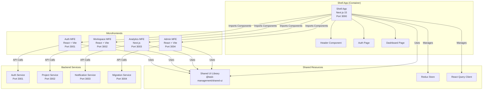
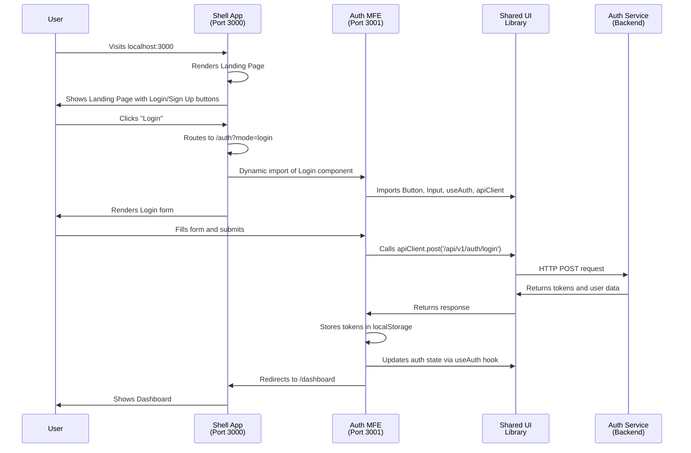
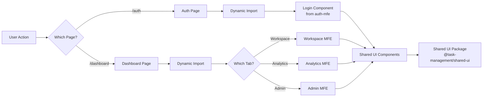
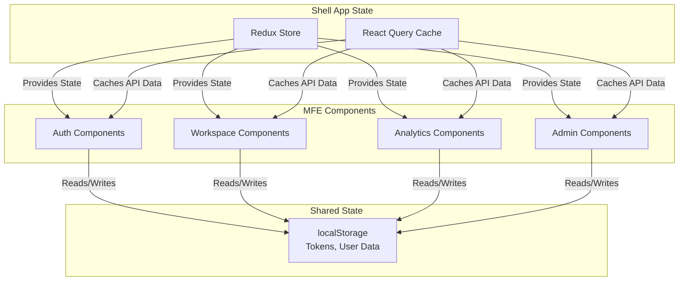
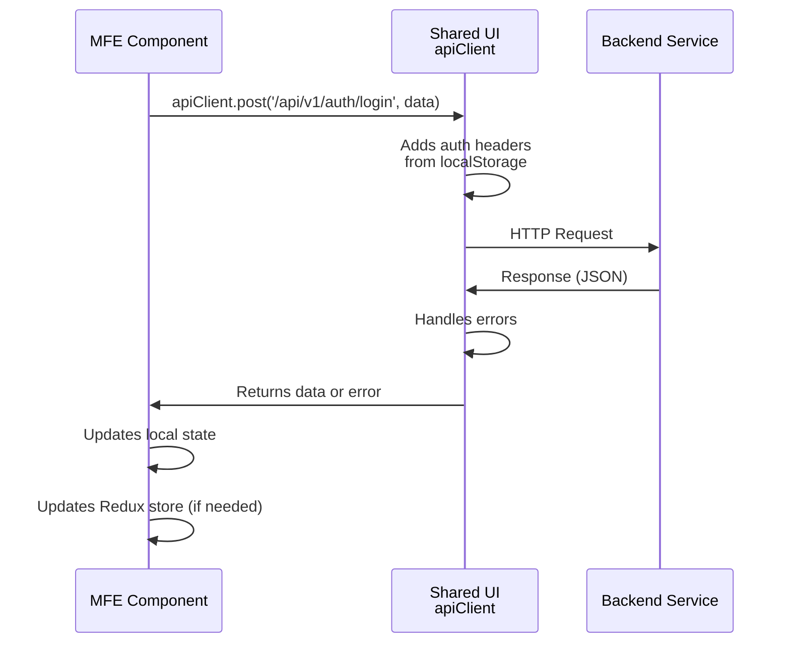
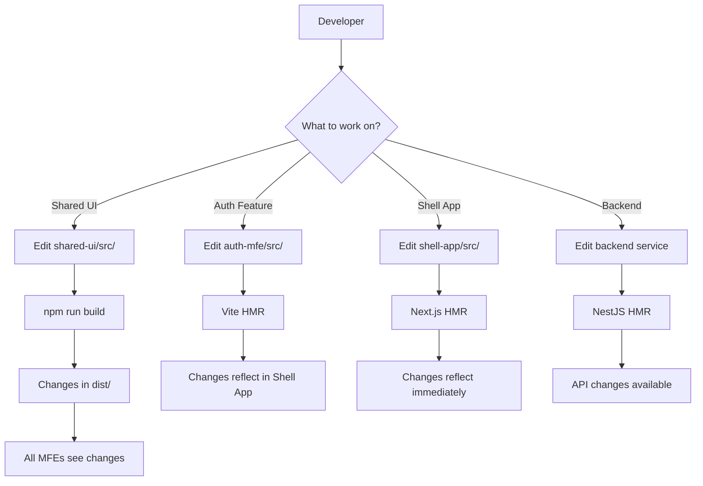

# 🏗️ Microfrontend Architecture Guide

## Table of Contents
1. [What are Microfrontends?](#what-are-microfrontends)
2. [Architecture Overview](#architecture-overview)
3. [Component Flow](#component-flow)
4. [Data Flow](#data-flow)
5. [Shared UI Package Publishing](#shared-ui-package-publishing)
6. [Development Workflow](#development-workflow)
7. [Benefits & Limitations](#benefits--limitations)

---

## What are Microfrontends?

Microfrontends are an architectural approach where a frontend application is split into smaller, independent applications. Each microfrontend (MFE):

- ✅ Has its own codebase and can be developed independently
- ✅ Can be deployed separately (with proper setup)
- ✅ Owns a specific feature or domain
- ✅ Can use different technology stacks (though yours are similar for consistency)
- ✅ Is integrated into a "shell" or "container" application

Think of it like microservices, but for the frontend!

---

## Architecture Overview

### System Architecture Diagram



### Component Structure

```
ticketing_system/
├── frontend/
│   ├── shell-app/              # Container application
│   │   ├── src/
│   │   │   ├── app/            # Next.js App Router pages
│   │   │   │   ├── page.tsx    # Landing page
│   │   │   │   ├── auth/       # Auth page (imports MFE)
│   │   │   │   └── dashboard/  # Dashboard (imports MFEs)
│   │   │   ├── components/     # Shell-specific components
│   │   │   └── store/          # Redux store
│   │   └── package.json
│   │
│   ├── auth-mfe/               # Authentication MFE
│   │   ├── src/
│   │   │   └── components/
│   │   │       ├── Login.tsx
│   │   │       ├── Register.tsx
│   │   │       └── Profile.tsx
│   │   └── package.json
│   │
│   ├── workspace-mfe/          # Workspace MFE
│   ├── analytics-mfe/          # Analytics MFE
│   ├── admin-mfe/              # Admin MFE
│   │
│   └── shared-ui/              # Shared UI Library
│       ├── src/
│       │   ├── components/     # Shared components
│       │   ├── hooks/          # Shared hooks
│       │   └── utils/          # Shared utilities
│       ├── dist/               # Built package
│       └── package.json
│
└── backend/
    ├── auth-service/
    ├── project-service/
    └── ...
```

---

## Component Flow

### User Journey Flow Diagram



### Component Loading Flow



### Step-by-Step Component Integration

#### Step 1: User Visits Application
```
User → http://localhost:3000 → Shell App starts
```

#### Step 2: Shell App Initializes
- Next.js renders the shell app
- Header component displays (with Login/Sign Up buttons)
- Global providers initialize:
  - Redux Provider (state management)
  - React Query Provider (API caching)
  - Config providers

#### Step 3: User Navigation
**Example: User clicks "Login"**

```
User clicks "Login" 
  → Shell app routes to /auth?mode=login
  → Auth page component loads
```

#### Step 4: Dynamic Component Import
The shell app uses Next.js `dynamic()` to import the MFE component:

```typescript
// In shell-app/src/app/auth/page.tsx
const Login = dynamic(
  () => import('../../../../auth-mfe/src/components/Login')
    .then((mod) => ({ default: mod.Login })),
  { ssr: false }
);
```

**What happens:**
1. Next.js bundles the Login component from `auth-mfe`
2. The component is loaded client-side (no SSR for MFE components)
3. React renders it inside the shell app's layout
4. The component appears seamlessly integrated

#### Step 5: Component Renders
- The Login component from `auth-mfe` renders
- It uses shared UI components:
  - `Button` from `@task-management/shared-ui`
  - `Input` from `@task-management/shared-ui`
- It uses shared hooks:
  - `useAuth` for authentication state
  - `apiClient` for API calls
- It appears inside the shell app's card container

#### Step 6: User Interaction
**Example: User submits login form**

```
User fills form → Clicks "Sign in"
  → Login component calls apiClient.post('/api/v1/auth/login')
  → Backend auth-service (port 3001) processes request
  → Response returns with tokens
  → Login component stores tokens in localStorage
  → Updates Redux state via useAuth hook
  → Redirects to /dashboard
```

#### Step 7: Dashboard Loads
- Shell app routes to `/dashboard`
- Dashboard page shows tabs for different MFEs
- User can switch between:
  - Workspace tab → loads Workspace MFE
  - Analytics tab → loads Analytics MFE
  - Admin tab → loads Admin MFE
- Each tab dynamically imports the corresponding MFE component

---

## Data Flow

### State Management Flow



### API Call Flow



### Shared State Details

#### Redux Store
- **Location**: Managed in shell app (`frontend/shell-app/src/store/`)
- **Access**: All MFEs can access via `useSelector` hook
- **State**: Authentication, UI state, etc.

#### React Query
- **Location**: Shared query client in shell app
- **Purpose**: API response caching, background refetching
- **Access**: All MFEs use `useApi` and `useApiMutation` hooks from shared-ui

#### LocalStorage
- **Purpose**: Persistent storage for tokens and user data
- **Access**: All MFEs can read/write
- **Data Stored**:
  - `accessToken`: JWT access token
  - `refreshToken`: JWT refresh token
  - `user`: User object (JSON stringified)

---

## Shared UI Package Publishing

### Overview

The Shared UI library (`@task-management/shared-ui`) is a **local npm package** that provides common components, hooks, and utilities to all MFEs and the shell app. It's published within the monorepo using npm workspaces.

### Package Structure

```
frontend/shared-ui/
├── src/
│   ├── components/          # React components
│   │   ├── Button.tsx
│   │   ├── Input.tsx
│   │   ├── Card.tsx
│   │   └── Modal.tsx
│   ├── hooks/               # Custom React hooks
│   │   ├── useAuth.ts
│   │   ├── useApi.ts
│   │   └── useWebSocket.ts
│   ├── utils/               # Utility functions
│   │   ├── api-client.ts
│   │   └── constants.ts
│   ├── types/               # TypeScript types
│   │   └── index.ts
│   └── index.ts             # Main export file
├── dist/                    # Built output
│   ├── index.js            # CommonJS build
│   ├── index.mjs           # ES Module build
│   ├── index.d.ts          # TypeScript definitions
│   └── [component files]   # Individual component definitions
├── package.json
├── tsconfig.json
└── vite.config.ts
```

### Package Configuration

#### `package.json` Structure

```json
{
  "name": "@task-management/shared-ui",
  "version": "1.0.0",
  "main": "dist/index.js",           // CommonJS entry point
  "types": "dist/index.d.ts",        // TypeScript definitions
  "module": "dist/index.mjs",        // ES Module entry point
  "scripts": {
    "build": "tsc && vite build"     // Build TypeScript + Vite
  },
  "peerDependencies": {
    "react": "^19.0.0",
    "react-dom": "^19.0.0"
  }
}
```

### Build Process

#### Step 1: TypeScript Compilation
```bash
tsc  # Compiles TypeScript to JavaScript + generates .d.ts files
```

**What happens:**
- TypeScript compiler reads `tsconfig.json`
- Compiles all `.ts` and `.tsx` files in `src/`
- Generates JavaScript files in `dist/`
- Generates TypeScript definition files (`.d.ts`) for type support
- Creates source maps for debugging

#### Step 2: Vite Build
```bash
vite build  # Bundles the library
```

**What happens:**
- Vite reads `vite.config.ts`
- Uses library mode configuration:
  ```typescript
  build: {
    lib: {
      entry: './src/index.ts',
      name: 'SharedUI',
      fileName: 'index',
      formats: ['es', 'cjs'],  // ES Modules + CommonJS
    },
    rollupOptions: {
      external: ['react', 'react-dom', ...],  // Don't bundle dependencies
    },
  }
  ```
- Creates two builds:
  - `dist/index.js` - CommonJS format (for Node.js/older bundlers)
  - `dist/index.mjs` - ES Module format (for modern bundlers)
- Externalizes peer dependencies (React, React DOM) so they're not bundled

#### Step 3: Type Definitions Generation
Using `vite-plugin-dts`:

```typescript
// vite.config.ts
import dts from 'vite-plugin-dts';

plugins: [
  dts({
    insertTypesEntry: true,    // Adds types to package.json
    include: ['src/**/*'],     // Include all source files
    outDir: 'dist',            // Output directory
  }),
]
```

**Output:**
- `dist/index.d.ts` - Main type definitions
- `dist/components/Button.d.ts` - Component type definitions
- `dist/hooks/useAuth.d.ts` - Hook type definitions
- etc.

### Publishing in Monorepo

#### How It Works

1. **NPM Workspaces Configuration**
   ```json
   // Root package.json
   {
     "workspaces": [
       "backend/*",
       "frontend/*",
       "shared-libs/*"
     ]
   }
   ```

2. **Local Package Installation**
   When you run `npm install` in the root:
   - NPM detects all workspace packages
   - Links `@task-management/shared-ui` as a local package
   - Creates symlinks in `node_modules/@task-management/`
   - No need to publish to npm registry!

3. **Package Resolution**
   When an MFE imports from shared-ui:
   ```typescript
   import { Button } from '@task-management/shared-ui';
   ```
   
   **Resolution process:**
   ```
   1. Bundler looks for @task-management/shared-ui
   2. Finds it in node_modules/@task-management/shared-ui
   3. Reads package.json to find entry points
   4. Imports from dist/index.js or dist/index.mjs
   5. TypeScript uses dist/index.d.ts for types
   ```

### Usage in MFEs

#### Installation
```json
// In auth-mfe/package.json
{
  "dependencies": {
    "@task-management/shared-ui": "^1.0.0"  // Local workspace package
  }
}
```

#### Importing Components
```typescript
// In any MFE component
import { Button, Input, Card } from '@task-management/shared-ui';
import { useAuth, useApi } from '@task-management/shared-ui';
import { apiClient } from '@task-management/shared-ui';
```

#### TypeScript Support
- Type definitions are automatically available
- IDE autocomplete works
- Type checking works across all MFEs

### Development Workflow

#### Making Changes to Shared UI

1. **Edit Source Files**
   ```bash
   cd frontend/shared-ui
   # Edit src/components/Button.tsx
   ```

2. **Rebuild Package**
   ```bash
   npm run build
   # This runs: tsc && vite build
   ```

3. **Changes Available**
   - All MFEs immediately see changes
   - No need to reinstall
   - Hot reload works in development

#### Development vs Production

**Development:**
- Changes to shared-ui require manual rebuild
- MFEs use the built `dist/` files
- Can use `npm run dev` in shared-ui for watch mode

**Production:**
- Shared UI is built as part of the build process
- Each MFE bundles shared-ui code
- Tree-shaking removes unused code

### Build Output Structure

```
dist/
├── index.js              # CommonJS entry (54.31 kB)
├── index.mjs             # ES Module entry (87.96 kB)
├── index.d.ts            # TypeScript definitions
├── index.d.ts.map        # Source map for types
├── components/
│   ├── Button.d.ts
│   ├── Button.d.ts.map
│   ├── Input.d.ts
│   ├── Input.d.ts.map
│   └── ...
├── hooks/
│   ├── useAuth.d.ts
│   ├── useApi.d.ts
│   └── ...
└── utils/
    ├── api-client.d.ts
    └── ...
```

### Key Points

✅ **Local Package**: Not published to npm, only used within monorepo  
✅ **Workspace Linking**: NPM workspaces automatically link the package  
✅ **Type Safety**: Full TypeScript support with generated `.d.ts` files  
✅ **Multiple Formats**: Both CommonJS and ES Modules for compatibility  
✅ **Tree Shaking**: Unused code is removed in production builds  
✅ **Peer Dependencies**: React/React DOM are not bundled (smaller size)  

---

## Development Workflow

### Starting the Application

```bash
# Start everything
npm run dev:all
```

**What starts:**
1. **Shell App** (port 3000) - Main container
2. **Auth MFE** (port 3001) - Authentication
3. **Workspace MFE** (port 3002) - Workspace management
4. **Analytics MFE** (port 3003) - Analytics
5. **Admin MFE** (port 3004) - Admin panel
6. **Backend Services** - All microservices

### Development Flow Diagram



### Hot Module Replacement (HMR)

- **Shell App**: Next.js Fast Refresh updates components instantly
- **Vite MFEs**: Vite HMR updates components without full page reload
- **Shared UI**: Requires manual rebuild (or use watch mode)

### Building for Production

```bash
# Build all packages
npm run build:all
```

**Process:**
1. Build shared-ui → `dist/` folder
2. Build all MFEs → `dist/` folders
3. Build shell-app → `.next/` folder
4. All packages are ready for deployment

---

## Benefits & Limitations

### ✅ Benefits

1. **Team Independence**
   - Different teams can work on different MFEs
   - Reduced merge conflicts
   - Independent release cycles

2. **Technology Flexibility**
   - Can use different frameworks (Next.js vs Vite)
   - Can upgrade independently
   - Technology choices per MFE

3. **Code Isolation**
   - Bugs in one MFE don't break others
   - Easier to test individual features
   - Clear boundaries between features

4. **Scalability**
   - Easy to add new MFEs
   - Can split large features into smaller MFEs
   - Better code organization

5. **Reusability**
   - Shared UI components used everywhere
   - Consistent design system
   - DRY (Don't Repeat Yourself) principle

### ⚠️ Limitations

1. **Build-Time Integration**
   - Components are bundled at build time
   - Not true runtime independence
   - All MFEs must be built together

2. **Monorepo Dependency**
   - All code is in one repository
   - Limits true independence
   - Requires coordination for shared changes

3. **Shared Dependencies**
   - All MFEs share React, shared-ui, etc.
   - Good for consistency
   - But limits version independence

4. **Bundle Size**
   - Shared code is duplicated in each MFE bundle
   - Can increase total bundle size
   - Tree-shaking helps but doesn't eliminate

5. **Development Complexity**
   - More moving parts
   - Need to understand multiple codebases
   - Debugging across MFEs can be challenging

---

## Summary

Your microfrontend architecture is a **monorepo-based approach** that provides:

- **Shell App** = Container/orchestrator (Next.js)
- **MFEs** = Feature modules (Auth, Workspace, Analytics, Admin)
- **Shared UI** = Common components and utilities (local npm package)
- **Integration** = Direct component imports (simple, works well for monorepo)
- **State** = Shared via Redux and React Query
- **API** = Shared client from shared-ui

This is an excellent approach for a monorepo where teams work together and you want simplicity while maintaining feature separation. It's simpler than true Module Federation but provides most of the benefits with less complexity.

---

## Quick Reference

### Ports
- **Shell App**: 3000
- **Auth MFE**: 3001
- **Workspace MFE**: 3002
- **Analytics MFE**: 3003
- **Admin MFE**: 3004

### Key Commands
```bash
npm run dev:all          # Start everything
npm run build:all        # Build everything
npm run dev:shell        # Start only shell app
npm run dev:auth-mfe     # Start only auth MFE
```

### Key Imports
```typescript
// In any MFE
import { Button, Input } from '@task-management/shared-ui';
import { useAuth, useApi } from '@task-management/shared-ui';
import { apiClient } from '@task-management/shared-ui';
```

---

*Last Updated: 2025-11-18*

